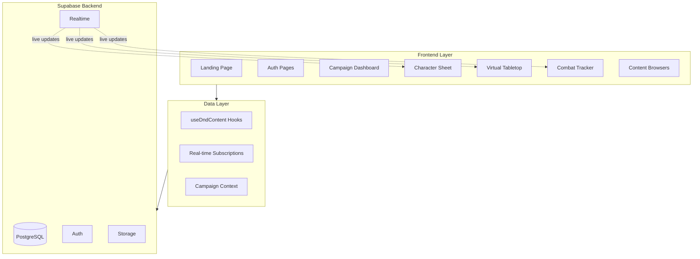

# Scryer - D&D 5e Digital Suite Master Plan

## Current State Assessment

### Completed Infrastructure

- Full database schema (27 tables) in Supabase
- TypeScript types generated in [`types/database.types.ts`](types/database.types.ts)
- Data hooks for all content types in [`hooks/useDndContent.ts`](hooks/useDndContent.ts)
- Authentication flow (login, signup, password reset)
- UI component library (shadcn/ui) fully configured
- Campaign context in [`contexts/campaign-context.tsx`](contexts/campaign-context.tsx)
- Dependencies: react-konva, tiptap, zod, react-hook-form

### Empty/Placeholder (To Build)

- Landing page (currently Supabase template)
- Campaign management system
- Character creation wizard
- Character sheets
- Virtual Tabletop (VTT)
- Combat tracker
- Content browsers
- Dice roller
- All campaign sub-routes

---

## Architecture Overview



---

## Phase 1: Foundation and Landing (Week 1)

### 1.1 Landing Page Redesign

Replace Supabase template in [`app/page.tsx`](app/page.tsx) with branded Scryer landing:

- Hero section with value proposition
- Feature highlights (VTT, character sheets, dice roller)
- CTA buttons for sign up / demo
- Existing theme with Cinzel headings

### 1.2 Layout System

Create shared layouts:

- `app/layout.tsx` - Global layout with theme provider
- `app/(marketing)/layout.tsx` - Marketing pages layout
- `app/campaigns/[campaignId]/layout.tsx` - Campaign dashboard layout with sidebar

### 1.3 Navigation Components

- `components/shared/navbar.tsx` - Main navigation
- `components/shared/sidebar.tsx` - Campaign sidebar navigation
- `components/shared/user-menu.tsx` - User dropdown with logout

### 1.4 Theme Configuration

Use existing theme files as they are already arranged---

## Phase 2: Campaign Management (Week 2)

### 2.1 Campaign CRUD

- `app/campaigns/page.tsx` - Campaign list/grid view
- `app/campaigns/new/page.tsx` - Create campaign form
- `app/campaigns/[campaignId]/page.tsx` - Campaign dashboard
- `app/campaigns/[campaignId]/settings/page.tsx` - Campaign settings

### 2.2 Campaign Hooks

Extend hooks with campaign management:

```typescript
// hooks/useCampaigns.ts
useCampaigns(userId)
useCampaign(campaignId)
useCreateCampaign()
useUpdateCampaign()
useDeleteCampaign()
useCampaignMembers(campaignId)
useInvitePlayer()
```

### 2.3 Campaign Components

- `components/campaign/campaign-card.tsx`
- `components/campaign/campaign-form.tsx`
- `components/campaign/member-list.tsx`
- `components/campaign/invite-dialog.tsx`

### 2.4 Campaign Dashboard Layout

```javascript
[Sidebar]              [Main Content]           [Right Panel]
- Characters           - Active Map/Welcome     - Party Info
- Spells               - Recent Activity        - Quick Actions  
- Monsters             - Session Notes          - Dice Roller
- Equipment
- Maps
- Combat
- Settings
```

---

## Phase 3: Character System (Weeks 3-4)

### 3.1 Character Creation Wizard

`app/character-creator/page.tsx` - Multi-step wizard:**Step 1: Race Selection**

- Grid of race cards with ability bonuses preview
- Homebrew race support via campaign context
- Selection stores `race_source` and `race_index`

**Step 2: Class Selection**

- Class cards with hit die and features preview
- Subclass selection (if level 3+)
- Stores `class_source` and `class_index`

**Step 3: Ability Scores**

- Three methods: Point Buy, Standard Array, Manual Roll
- Live modifier calculations
- Apply racial bonuses

**Step 4: Background and Details**

- Background selection
- Alignment picker
- Name, personality traits

**Step 5: Equipment**

- Starting equipment from class
- Gold alternative option

**Step 6: Review and Submit**

- Full preview of character
- Submit to database

### 3.2 Character Sheet Components

- `components/character/character-sheet.tsx` - Main sheet layout
- `components/character/ability-scores.tsx` - Six stats with modifiers
- `components/character/combat-stats.tsx` - HP, AC, Initiative, Speed
- `components/character/skills-panel.tsx` - All 18 skills with proficiency
- `components/character/saving-throws.tsx` - Six saves with proficiency
- `components/character/spell-slots.tsx` - Slot tracking with expend/restore
- `components/character/spell-list.tsx` - Prepared spells with details
- `components/character/inventory.tsx` - Equipment management
- `components/character/features-traits.tsx` - Class/race features
- `components/character/notes.tsx` - Tiptap rich text editor

### 3.3 Character Sheet Page

`app/campaigns/[campaignId]/characters/[characterId]/page.tsx`

- Full sheet with real-time updates
- Editable fields for DM and owner
- HP adjustment buttons with animations
- Condition toggles

### 3.4 Character List Page

`app/campaigns/[campaignId]/characters/page.tsx`

- Grid of character cards
- Create new character button
- Filter by player

---

## Phase 4: Content Browsers (Week 5)

### 4.1 Spell Browser

`app/campaigns/[campaignId]/spells/page.tsx`

- Filter: Level (0-9), School, Class, Concentration, Ritual
- Search by name
- SRD/Homebrew toggle
- Click to expand full details
- "Add to Character" action

Components:

- `components/content/spell-browser.tsx`
- `components/content/spell-card.tsx`
- `components/content/spell-detail-dialog.tsx`
- `components/content/spell-filters.tsx`

### 4.2 Monster Compendium

`app/campaigns/[campaignId]/monsters/page.tsx`

- Filter: CR range, Type, Size
- Full stat block view
- "Add to Encounter" action
- "Clone & Modify" for homebrew

Components:

- `components/content/monster-browser.tsx`
- `components/content/monster-stat-block.tsx`
- `components/content/monster-filters.tsx`

### 4.3 Equipment Browser

`app/campaigns/[campaignId]/equipment/page.tsx`

- Filter: Category (Weapon, Armor, Gear, Tools)
- Subcategory filters
- Cost sorting
- "Add to Inventory" action

### 4.4 Homebrew Creator Forms

- `components/homebrew/spell-creator.tsx` - Full spell form with Zod validation
- `components/homebrew/monster-creator.tsx` - Stat block builder
- `components/homebrew/equipment-creator.tsx` - Item form
- Clone from SRD pattern: Load SRD data, modify, save as homebrew

---

## Phase 5: Virtual Tabletop and Combat (Weeks 6-8)

### 5.1 Map System

`app/campaigns/[campaignId]/maps/page.tsx `- Map library`app/campaigns/[campaignId]/maps/[mapId]/page.tsx` - Active map view**Map Components:**

- `components/map/map-canvas.tsx` - Konva.js canvas wrapper
- `components/map/map-grid.tsx` - Square/hex grid overlay
- `components/map/map-toolbar.tsx` - DM controls
- `components/map/map-uploader.tsx` - Image upload to Supabase Storage

**Token System:**

- `components/map/token.tsx` - Draggable token component
- `components/map/token-inspector.tsx` - Right panel token details
- `components/map/add-token-dialog.tsx` - Add character/monster tokens

### 5.2 Map Hooks

```typescript
// hooks/useMap.ts
useMap(mapId)
useMaps(campaignId)
useCreateMap()
useUpdateMap()
useTokens(mapId) // Real-time subscriptions
useCreateToken()
useUpdateToken()
useMoveToken() // Debounced position updates
```

### 5.3 Combat Tracker

`app/campaigns/[campaignId]/combat/page.tsx`**Features:**

- Initiative rolling for all participants
- Turn order list (sorted by initiative)
- Current turn indicator
- Round counter
- HP quick adjustment
- Condition toggles
- Concentration tracking
- Death saves

**Components:**

- `components/combat/combat-tracker.tsx` - Main tracker
- `components/combat/initiative-list.tsx` - Turn order
- `components/combat/participant-row.tsx` - Single participant
- `components/combat/add-combatant-dialog.tsx`
- `components/combat/condition-picker.tsx`
- `components/combat/death-saves.tsx`

### 5.4 Combat Hooks

```typescript
// hooks/useCombat.ts
useCombatEncounter(encounterId)
useEncounters(campaignId)
useCreateEncounter()
useParticipants(encounterId) // Real-time
useAddParticipant()
useUpdateParticipant()
useNextTurn()
usePreviousTurn()
```

### 5.5 VTT Integration

Combine map + combat:

- Tokens linked to combat participants
- HP changes sync bidirectionally
- Token movement reflects on combat tracker
- Combat initiative order visible on map

---

## Phase 6: Dice Roller and Polish (Weeks 9-10)

### 6.1 Dice Roller

`components/dice/dice-roller.tsx` - Floating panel**Features:**

- Standard dice buttons (d4, d6, d8, d10, d12, d20, d100)
- Custom expression input (2d6+5, 4d8+3+1d6)
- Advantage/disadvantage toggle
- Roll animation
- Roll history (last 10 rolls)
- Share to party vs private roll
- Critical success/failure highlights

**Implementation:**

- Parse dice expressions with regex or dice-roller-parser
- Animate 3D dice or 2D sprite animations
- Real-time broadcast for shared rolls
- Sound effects (optional toggle)

### 6.2 Quick Roll Integration

- Click modifiers on character sheet to roll
- Roll attack/damage from spell cards
- Roll skill checks with proficiency
- Roll saving throws

### 6.3 User Profile

`app/profile/page.tsx`

- Display name editing
- Avatar upload to Supabase Storage
- Campaign membership list
- Character list
- Theme preference

### 6.4 Polish and UX

- Loading skeletons for all data-fetching components
- Error boundaries with friendly messages
- Toast notifications for actions (sonner)
- Keyboard shortcuts (next turn, roll dice)
- Responsive design for tablet
- Performance optimization (React.memo, useMemo)

---

## Phase 7: Testing and Launch (Weeks 11-12)

### 7.1 SRD Data Seeding

Create seed script: `scripts/seed-srd.ts`

- Fetch from 5e-SRD-API or bundled JSON
- Insert into srd_* tables
- Add to package.json: `"seed:srd": "npx ts-node scripts/seed-srd.ts"`

### 7.2 RLS Policies

Add Row Level Security in Supabase:

- Campaigns: Owner and members only
- Characters: Owner and campaign members
- Homebrew: Campaign members only
- Maps/Tokens: Campaign members only
- Real-time: Validate campaign membership

### 7.3 Testing

- Unit tests for hooks and utility functions
- Integration tests for character creation flow
- E2E tests with Playwright:
- User signup/login
- Create campaign
- Create character
- Move token on map
- Combat encounter flow

### 7.4 Documentation

- User guide in `docs/user-guide.md`
- DM quick start in `docs/dm-guide.md`
- README updates with setup instructions

### 7.5 Deployment

- Vercel deployment configuration
- Environment variables setup
- Supabase production project
- Domain configuration

---

## File Structure After Implementation

```javascript
app/
├── (marketing)/
│   ├── page.tsx              # Landing page
│   └── layout.tsx
├── campaigns/
│   ├── page.tsx              # Campaign list
│   ├── new/page.tsx          # Create campaign
│   └── [campaignId]/
│       ├── layout.tsx        # Dashboard layout
│       ├── page.tsx          # Dashboard home
│       ├── characters/
│       │   ├── page.tsx      # Character list
│       │   └── [characterId]/page.tsx
│       ├── spells/page.tsx
│       ├── monsters/page.tsx
│       ├── equipment/page.tsx
│       ├── maps/
│       │   ├── page.tsx
│       │   └── [mapId]/page.tsx
│       ├── combat/page.tsx
│       └── settings/page.tsx
├── character-creator/page.tsx
├── profile/page.tsx
└── auth/...

components/
├── shared/
│   ├── navbar.tsx
│   ├── sidebar.tsx
│   └── user-menu.tsx
├── campaign/
│   ├── campaign-card.tsx
│   ├── campaign-form.tsx
│   └── member-list.tsx
├── character/
│   ├── character-sheet.tsx
│   ├── ability-scores.tsx
│   ├── combat-stats.tsx
│   └── ...
├── content/
│   ├── spell-browser.tsx
│   ├── monster-browser.tsx
│   └── ...
├── map/
│   ├── map-canvas.tsx
│   ├── token.tsx
│   └── ...
├── combat/
│   ├── combat-tracker.tsx
│   └── ...
├── dice/
│   └── dice-roller.tsx
└── homebrew/
    └── ...

hooks/
├── useDndContent.ts          # Existing
├── useCampaigns.ts           # New
├── useMap.ts                 # New
├── useCombat.ts              # New
└── useDiceRoller.ts          # New


```